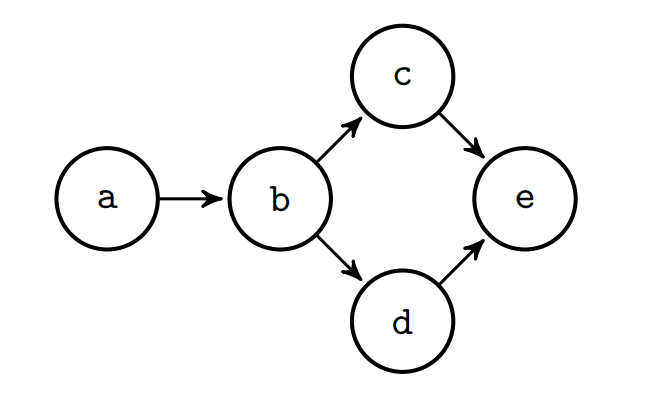
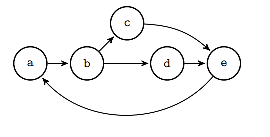

In this new video, we will see how to write a simple Prolog program to find paths in a graph.

# Finding Paths in Graphs
As you may have understood from the previous videos, Prolog is particularly good at expressing relations.

Several real world scenarios can be represented as graphs, such as social networks and road connections.

A graph is composed by a set of edges.
We indicate these edges with `edge/2` facts, where `edge(A,B)` denotes a directed edge between `A` (source) and `B` (destination).
We consider directed graph, meaning that the edges have orientations (from source to destination).

We now need to state what is a path.
A possible definition is the following: a path is a set of edges that, starting from a given source node, allows us to reach a given destination node.

If source and destination are not directly connected, we must pass through intermediate nodes.

The conversion of these two statements from natural language to Prolog is straightforward.

If source and destination are connected by an edge, there is a path between them.

Otherwise, if source and destination are not directly connected (in the general case), we select an intermediate node (connected to the current source) and continue the search from this new node toward the destination.

This can be expressed with a Prolog program as:
```Prolog
% There is a path from X to Y if X and Y are connected by an edge
path(X,Y):- edge(X,Y).

% There is a path from X to Y if there is an
% intermediate node Z from where the destination Y
% can be reached
path(X,Y):-
    edge(X,Z),
    path(Z,Y).
```
The predicate (a collection of clauses with the same functor) `path/2` is an example of recursive predicate since, in the body, there is a call to itself.

Let's add some `edge/2` facts and try this program.

Suppose we want to represent the following network with directed edges



To do this, we add the following facts to the previous program (for convenience, we add them before the `path/2` predicate)
```
edge(a,b).
edge(b,c).
edge(b,d).
edge(c,e).
edge(d,e).
```
and ask some queries:
```
?- path(a,b).
true
```

We get a first `true` solution.

Source and destination are connected by an edge, the first rule matches, and `path(a,b)` is true. 

However, there are choice points open, so there can be other solutions.
```
...
true ;
false.
```
Before returning `false`, the Prolog interpreter explores all the possible existing connections.

If source and destination are connected by more than one path (for example `a` and `e`), we obtain more solutions
```
?- path(a,e).
true ;
true ;
false.
```

Someone may have noticed that the graph we used does not contain loops.

Try to add one fact, for example
```
edge(e,a).
```
The graph now is



If we ask the same query
```
?- path(a,e).
true ;
true ;
true ;
true ; 
...
```

What happens? 
We get an infinite number of solutions since we pass an infinite number of times from the same nodes: for example, a path from `a` to `e` can be `{a,b,d,e}`, another one `{a,b,d,e,a,b,d,e}`, and so on.
Clearly, we need a way to also fix this behavior.

A solution can involve, for example, storing in some way the already visited nodes in a *list* to avoid passing multiple times by the same edges.
Other, more sophisticated solutions, may use more advances techniques, such as *tabling*.
We will consider both of these solutions in a next video.